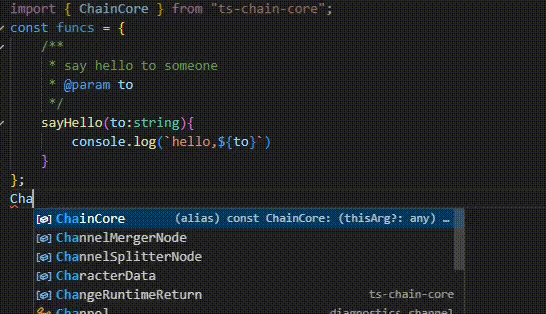

<p align="center">
  
</p>
<p align='center'>
  English |  <a style="color:#D437B5;transition: all 0.5s ease;" onmouseover="this.style.color='#0069D3'"
    onmouseout="this.style.color='#D437B5'"  href='./README.en.md'> 简体中文 </a> 
</p>


# ts-chain-core

This is a basic library for TypeScript chain programming. It can be used to build anything from simple tools to comprehensive toolkits.

### Features

- Enables chain programming with minimal code
- Saves code: tools built using this library can reduce actual code by half or more in some cases
-  **💥💥Auto Interface Completion **  Interfaces you write will automatically appear in your code as you type! Below is an actual demonstration (using vscode, no special plugins)

- **🌈Easy to use** You only need to master three core APIs to create chain interfaces that meet most needs.
- **🚀Compact** The program itself is only `3kb` in size after compression.


### Quick Start

#### Installation

```shell
npm i ts-chain-core
```
#### Basic Usage

```ts
import { ChainCore } from "ts-chain-core";

ChainCore(null)
    .setFunction((name: string) => {
        console.log(`hello,${name}`);
    })
    ('🍉')
    ('🍍')
    ('🥭')
```

### 🔗Turning Class Methods into Chainable Methods

```ts
class Example {
    toChain(){
        return ChainCore(this).extendFunctionsFromObject(Example)
    }
    add(a:number,b:number){
        console.log(a+b)
    }
    addOne(a:number){
        return (b:number)=>{
            console.log(a+b)
        }
    }
    addEnd(a:number,b:number){
        return a+b;
    }
}

new Example().toChain()
    .add(3,5)   //8
    .add(4,7)   //11
    .addOne(4)  
        (5)     //9
        (6)     //10
        (7)     //11
    .addEnd(11,10)  //chain ended here
    .add(42,1)  //❌error, chain function break
```


When extending the library, different chainable methods will be generated based on the return type of the methods.
| Return Types | `undefined / void` | `function` | other types |
| --- | --- | --- | -- |
| modify the `()` operation | No | set function to `()` operation | No |
| terminate the chain | No | No | No |

But the `()` operation does not change `()` operation itself regardless of its return type.

### 🔗Extending Instance Methods

In the process of extending methods, you may need to call methods that have already been extended by `ChainCore` or methods that are inherent to `ChainCore`. In such methods, you need to add a reference to `ChainCore` instance in the entry parameters.
`ts-chain-core` provides a method for extending these methods and automatically passing in the `ChainCore` instance when the method is called. We refer to these methods as **instance methods**.

Example of Extending Methods


```ts
ChainCore(null).extendFunctionsFromObject({
    sayHello: (name: string) => {
        console.log(`hello,${name}`);
    },
}).extendInstanceFunctions({
    /**
     * play a scenario
     * @param ch passed by `ChainCore` and reference to itself
     * @param time 
     * @param place 
     * @param to 
     */
    play(ch,time:string,place:string,to:string){
        console.log(`This is ${time},${place}`);
        ch.sayHello(to)
    }
}).play('morning','garden','🍓')
```

When extending `instance methods`, the first entry parameter should be reserved for `ts-chain-core`. It does not need to be annotated with a type, and does not have to be passed in when called.

#### Callbacks in Extended Methods

In extended methods, you may need to access `ChainCore` methods inside callbacks. Below is a different implementation of the previous example:

```ts
ChainCore(null).extendFunctionsFromObject({
    sayHello: (name: string) => {
        console.log(`hello,${name}`);
    },
}).extendInstanceFunctions({
    /**
     * play a scenario
     * @param ch passed by `ChainCore` and reference to itself
     * @param fn play anything you wanted in this function
     */
    play(ch,fn:(ch:CurrentStateChainRef)=>void){
        fn.apply(null,[ch]);
    }
}).play((ch)=>{
    console.log(`This is morning,garden`);
    ch.sayHello('🍓')
})        
```
The first parameter in the callback function should be annotated with the `CurrentStateChainRef` type. When called, the passed-in `ChainCore` instance will automatically receive code hints for previously extended methods.

`Instance methods` can also have the `()` operation set, and callbacks can use it to access the `ChainCore` instance.

```ts
ChainCore(null).extendFunctionsFromObject({
    sayHello: (name: string) => {
        console.log(`hello,${name}`);
    },
}).extendInstanceFunctions({
    play(ch){
        return (fn:(ch:CurrentStateChainRef,time:string,place:string,to:string)=>void,time:string,place:string,to:string)=>{
            fn.apply(null,[ch,time,place,to]);
        }
    }
}).play()((ch,time,place,to)=>{
    console.log(`This is ${time},${place}`);
    ch.sayHello(to)
},'morning','garden','🍓');
```

**Attention** 📢📢 *It is important to note that the `ChainCore` instance in the callback function is passed in by the extended method itself. You do not need to pass the `ChainCore` instance as the first parameter, but it is convention to annotate the type of the first parameter as `CurrentStateChainRef` so that it is properly recognized as the `ChainCore` type.*


##### 📑Type Remapping

`ts-chain-core` uses type remapping to achieve automatic type conversions for convenient auto-completion features. `CurrentStateChainRef` is one example of this. More examples will be discussed later.

However, there are limitations to this technique. Firstly, due to restrictions in `TypeScript`, it is not practical to automate type conversions for all parameters. To strike a balance between usability and computational overhead, this feature currently only supports the automatic conversion of the return type and the first four parameters. In the majority of cases, this is sufficient.

Additionally, remapping does not support generic mappings. However, ts-chain-core provides a solution for this, which will be discussed later.


##### 🔍Declaring ChainCore Types

Since `ChainCore` is a complex type, there may be situations where you need to declare the `ChainCore` type with certain methods extended. In most cases, directly writing the `ChainCore` type is not recommended due to its complexity. Instead, it is recommended to use type inference to declare the type.

```ts
//Declaration Example
function chainFactory(){
    return ChainCore(null).extendFunctionsFromObject({
                sayHello: (name: string) => {
                    console.log(`hello,${name}`);
                },
                //some other functions
            })
}

type MyChainType = ReturnType<typeof chainFactory>;

function myFunction(ch:MyChainType){
    ch.sayHello('')
}
```


#### 🔍`thisArg`

`thisArg` is a built-in variable in `ChainCore` that is used to set the `this` value in the running methods.

It can be passed through `ChainCore()`, or accessed and modified during runtime using `getThis() `and `setThis()`.

#### `arguments cache`

To avoid repetitive input, `ChainCore` caches the arguments from the previous call at runtime. If no arguments are passed or if `undefined` is passed, `ChainCore` will use the values from the previous call as substitutes.

```ts
UIKit(this)
    .show()
        ('myUsernameEditor',props.mode==='edit')  //show these controls when user need edit
        ('myAddressEditor')
        ('myEmailEditor')
        ('myPhotoEditBtn')
        ('myUsernameLabel',props.mode==='view')  //show these controls when just read
        ('myAddressLabel')
        ('myEmailLabel')
```

In most cases, this feature is helpful. However, in some situations, it may lead to confusing results and mistakenly be seen as a bug in the program.

```ts
ChainCore(null)
    .extendInstanceFunctions({
        log(ch,...args:any){
        console.log(...args)
        }
    })
    //confused output
    .log('a','b','c')                 // stdout: a b c
    .log('d')                         // stdout: d b c  
    .log(undefined,'e',undefined)     // stdout: d e c
```
`ts-chain-core` provides the `clearArgCache()` method to clear the cache from the previous call. 

```ts
//proper version
ChainCore(null)
    .extendInstanceFunctions({
        log(ch,...args:any){
        ch.clearArgCache();
        console.log(...args)
        }
    })
    .log('a','b','c')                 // stdout: a b c
    .log('d')                         // stdout: d 
    .log(undefined,'e',undefined)     // stdout:  e 
```

You can also call it to clear potential memory leaks.

```ts
const persistChainInstance =  ChainCore(null)
    .extendInstanceFunctions({
        on(ch,obj:any,eventName:string,fun:Function){
            ch.clearArgCache(); //prevent fun be cached
            obj.addEventListener(eventName,fun)
        }
    })

```

#### Batch Operations

`ts-chain-core` provides two methods for batch `()`operations.

```ts
ChainCore(null)
    .setFunction((m: number, n?: number) => {
        console.log(Math.pow(m, n || 0));
    })
    .batch([3, 4], [1, 2], [5, 6], [1], [2], [3]);

ChainCore(null)
    .setFunction((m: number, n?: number) => {
        console.log(Math.pow(m, n || 0));
    })
    .zipBatch([1, 2, 3, 4, 5, 6], [2]);
    //equal to 
    .batch([1,2],[2],[3],[4],[5],[6]);

```
Batch operations still follow the argument caching rules.

### 🔗Extending the Runtime

In addition to `thisArg` and the `arguments cache`, the runtime of `ChainCore` can be extended by the user. The extended properties can be accessed through the runtime interface.

```ts
const ch = ChainCore(null)
    .extendRuntime<{value:string}>()  //extend a field names `value`
    .extendInstanceFunctions({
        setValue(ch,value:string){
            ch.runtime.value = value;   //write to value
        },
        getValue(ch){
            return ch.runtime.value;   //access value
        }
    });
const result = ch.setValue('hello').getValue();
console.log(result) //hello
```

Here is an simple example that mimics `JQuery`.

```ts
import { ChainCore, CurrentStateChainRef } from "ts-chain-core";

type QueryType = string | Document | HTMLElement | EventTarget | null;

const getQuery = (q: QueryType) => {
  if (q === null || q === undefined) return document.body;
  if (typeof q === "string") {
    return document.querySelector(q) as HTMLElement;
  } else return q as HTMLElement;
};
const $ = (q: QueryType) => {

  return ChainCore(null)
    .extendRuntime<{ dom: HTMLElement }>()
    .extendInstanceFunctions({
      ready(ch, fn: () => void) {
        ch.runtime.dom.addEventListener("DOMContentLoaded", fn);
      },
      click(ch, fn: (ch: CurrentStateChainRef, event: MouseEvent) => void) {
        ch.runtime.dom.onclick = (event: MouseEvent) => fn(ch, event);
      },
      addClass(ch, className: string) {
        ch.runtime.dom.classList.add(className);
      },
      removeClass(ch, className: string) {
        ch.runtime.dom.classList.remove(className);
      },
      show(ch) {
        ch.runtime.dom.style.display = "";
      },
      hide(ch) {
        ch.runtime.dom.style.display = "none";
      },
      text(ch, str: any) {
        ch.runtime.dom.textContent = str;
      },
      query(ch, q: QueryType) {
        ch.runtime.dom = getQuery(q);
      },
    })
    .query(q);
};

$(document).ready(() => {
  $(".button")
    .extendRuntime({
      clicked: false,
    })
    .click((ch, event) => {
      ch.runtime.clicked = !ch.runtime.clicked;
      if (ch.runtime.clicked) {
        $(event.currentTarget)
          .addClass("clicked")
          .query("h2")
          .hide()
          .query("h1")
          .text("Hello, Chain!")
          .show();
      } else {
        $(event.currentTarget)
          .removeClass("clicked")
          .query("h2")
          .show()
          .query("h1")
          .hide();
      }
    });
});
```
You can [try running it on the web](https://codesandbox.io/p/github/maxzhou0/ts-chain-core-web-demo/main?file=%2Fsrc%2Fmain.ts)

#### 🚀Dynamically Modifying and Referencing Runtime Type

In some applications, it is not possible to predict the exact type of data in advance. For example, if you are creating a function library that operates on arrays, you cannot specify the exact type when defining the methods. This requires dynamic adjustment of generic parameters, which is currently not supported in `TypeScript`. `ts-chain-core` provides the `ReferTo<>` type to reference runtime types and the `ChangeChainRuntime<,>` type to dynamically modify runtime types.

```ts

const ch = ChainCore(null)
    .extendRuntime<{group:any[]}>()
    .extendInstanceFunctions({
        /**
         * 
         * @param ch 
         * @param value ReferTo<'<0>'> which means use the first generic type as input type
         * @returns ChangeChainRuntime<'group','<0>'> means change runtime `group' type to first generic type
         */
        group(ch,value:ReferTo<'<0>'>):ChangeChainRuntime<'group','<0>'>{
            ch.runtime.group = value;
            return ChangeRuntimeReturn();  //call this function to actually change runtime type
        },
        setToIndex(ch,value:ReferTo<'group[number]'>,index:number){
            ch.runtime.group[index] = value;
        },
        each(ch,fn:(item:ReferTo<'group[number]'>,index?:number)=>void){
            ch.runtime.group.forEach(fn);
        }
    });
ch.group([0,1,2,3]) //group<number[]> will change  setToIndex and each's function parameter type to number
    .setToIndex(42,0)
    //.setToIndex('42',0)  ❌error,'42' doesn't match type number
    .each((item,index)=>{
        console.log(index,item)
    })  //output : 42,1,2,3

```

You may have noticed that every extension method in `ts-chain-core` is actually a generic method with four type parameters. You can use `ReferTo<'<0>'>`, `ReferTo<'<1>'>`, `ReferTo<'<2>'>`, and `ReferTo<'<3>'>` to dynamically modify types, and use `ChangeChainRuntime<,>` to modify runtime type parameters.

##### 🚀`ReferTo<>`Syntax

ReferTo<`T[]`> means it is an array type of type `T`.
ReferTo<`T[number]`> means it is an array element type of type `T`. (*Note: `T` must be an array type, or you will get a type error.*)
You can also use the path symbol `::` to represent the type of a property in a complex type.
Here is an example (*this is just for demonstration purposes and does not necessarily mean you need to use `ReferTo<>` to refer to a type, unless it's a type that needs to be expressed using generics*).

```ts
ChainCore(null).extendRuntime<{
        actor:{
            name:string,
            birthDate:Date,
            movie:{
                title:string,
                year:number,
                genre:[{id:number,key:string,name:string}]
            }[]
        }
    }>()
    .setFunction((input:ReferTo<'actor::movie[number]::genre[number]'>)=>{
        console.log((input as any).name)
    })
    ({id:1,key:'comedy',name:'comedy'})
```

##### 🚀 `Combining Multiple Extension Types`

Use `ReMapTo<>` to combine the types of multiple extension runtime attributes into a new type.
```ts
const v = ChainCore(null)
    .extendRuntime<{name:string,age:number}>()
    .extendInstanceFunctions({
        setPerson(ch,values:ReMapTo<'name'|'age'>){
            ch.runtime.age = (values as any).age;
            ch.runtime.name = (values as any).name;
        },
        getPerson(ch):ReMapTo<'name'|'age'>{
            return {...ch.runtime} as any;
        }
    })
    .setPerson({name:'Amy',age:42})
    .getPerson().name;
console.log(v) //Amy
```